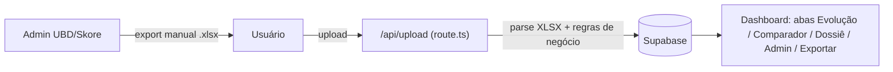
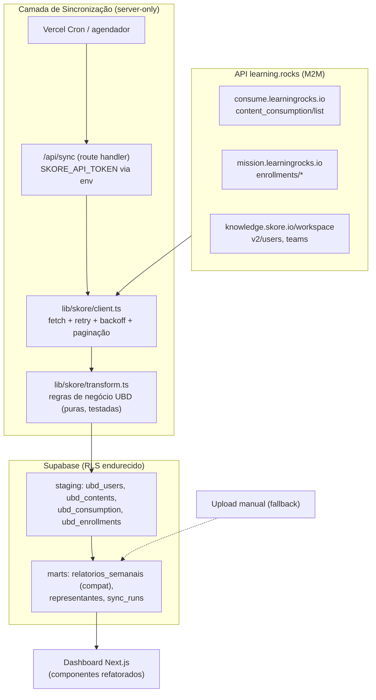

# Plano de Projeto — Dashboard UDB: do Upload Manual à Integração via API

> **Versão:** 1.0 · **Data:** 2026-07-19 · **Autor:** Engenharia (Claude Code + Osvaldo Bello)
> **Status:** 🟡 Aguardando aprovação
> **Documento par:** [MASTER.md](../MASTER.md) — documento vivo que rege a execução.

---

## 1. Sumário Executivo

O Dashboard UDB hoje depende de um processo manual: toda semana alguém entra no painel
admin da UBD (plataforma Skore/learning.rocks), exporta planilhas Excel por representante
e as anexa no sistema, que processa e grava agregados semanais no Supabase.

Este projeto substitui o anexo manual por **sincronização automática via API oficial da
learning.rocks** (company key da Bondmann), transformando o dashboard em um painel vivo,
com dados atualizados sem intervenção humana — mantendo **100% das features atuais**
(comparador semanal, exportações XLSX/ZIP, dossiê, entrada manual como fallback) e
elevando o padrão de engenharia: segurança de ponta a ponta, RLS endurecido, testes
unitários e de contrato, benchmarks e CI/CD.

Inclui também a **refatoração do frontend**: quebrar o monólito de 2.516 linhas
(`app/dashboard/page.tsx`) em componentes, e redesenhar a interface com identidade
própria (fugindo do visual "template de IA"), preservando a didática para usuários leigos.

---

## 2. Estado Atual (As-Is)

### 2.1 Stack

| Camada | Tecnologia |
|---|---|
| Framework | Next.js **16.2.9** (App Router — ⚠️ versão com breaking changes, ver `AGENTS.md`) |
| UI | React 19.2.4, Tailwind CSS 4, Recharts 3, lucide-react |
| Banco/Auth | Supabase (`@supabase/ssr`, `@supabase/supabase-js`) |
| Planilhas | `xlsx` (SheetJS) + `jszip` para exportação em lote |
| Testes | Vitest 4 (3 suítes: exportação de comparação, exportação multi, validação de senha) |
| Deploy | Vercel (presumido — projeto create-next-app padrão) |

### 2.2 Fluxo de dados atual



### 2.3 Regras de negócio embutidas em `app/api/upload/route.ts`

Estas regras são o **coração do domínio** e devem ser preservadas na migração:

1. **Ignorar** conteúdos "Café com Química".
2. **Exame** = título termina com "- Exame" (ou contém "- Exame ").
3. **Concluído**: conteúdo ≥ 97% de progresso; exame = exatamente 100%.
4. **Aproveitamento Geral (absoluto)** = concluídos ÷ catálogo total (tabela
   `configuracoes`: `total_aulas` default 136 + `total_exames` default 112).
5. **Aproveitamento Relativo** = concluídos ÷ iniciados.
6. Semana ISO (segunda-feira como `semana_ano`), upsert por `(representante_id, semana_ano)`.
7. Parsing de nome/região (RS/SP/MG) a partir do nome do arquivo (fallback legado).

### 2.4 Modelo de dados atual (Supabase)

- `perfis` (roles: `admin` | `supervisor`, trigger de auto-criação no signup)
- `representantes` (nome único global, meta default 95%, região RS/SP/MG, observações)
- `relatorios_semanais` (agregados + `detalhes` JSONB com lista de cursos/exames)
- `configuracoes` (totais do catálogo — usada no código, **ausente do `supabase_schema.sql`** ⚠️)

### 2.5 Débitos técnicos identificados

| # | Débito | Gravidade |
|---|---|---|
| D1 | `app/dashboard/page.tsx` com 2.516 linhas, ~40 `useState`, toda a lógica no cliente | Alta |
| D2 | Políticas RLS `USING (true)` para authenticated em representantes/relatórios — qualquer usuário autenticado lê/edita/apaga tudo; role `supervisor` não restringe nada | **Alta (segurança)** |
| D3 | Mensagem de erro diz "10MB" mas a constante permite 50MB | Baixa |
| D4 | Validação de MIME por `file.type` (spoofável) sem checagem de magic bytes | Média |
| D5 | Arquivos de teste soltos na raiz (`test_network.js`, `test_sb.js`, `test_signup_api.js`) | Baixa |
| D6 | `configuracoes` sem migração versionada; schema em um único `.sql` sem histórico | Média |
| D7 | README genérico do create-next-app | Baixa |
| D8 | Sem CI/CD, sem secret scanning, sem typecheck no pipeline | Alta |
| D9 | `app/dashboard/page.tsx` viola 43 regras do lint do Next.js 16 (React Compiler: `react-hooks/preserve-manual-memoization`, `react-hooks/set-state-in-effect`) — descoberto em 2026-07-19 ao instalar Node/rodar `npm run lint` pela primeira vez nesta sessão. Não bloqueia CI por ora (`continue-on-error`); resolver junto da Fase 5 | Média (vira Alta se ignorada até a Fase 5) |
| D10 | `npm audit`: (a) `postcss <8.5.10` (moderate, XSS via `</style>` não escapado) — transitivo de `next`, sem fix sem downgrade catastrófico do Next.js; risco baixo na prática (não fazemos stringify de CSS não confiável). (b) **`xlsx` (SheetJS) — high, Prototype Pollution + ReDoS, sem fix disponível do fornecedor.** Agrava porque `xlsx` processa arquivos `.xlsx` enviados por usuários em `app/api/upload/route.ts` (superfície de ataque real, não teórica). Decisão de trocar/mitigar a lib exige aprovação do Osvaldo (ver §9 Riscos) | (a) Baixa — monitorar; (b) **Alta — decidir antes/durante a Fase 5** |

---

## 3. Solução Alvo (To-Be)

### 3.1 Princípios

1. **A chave da API nunca sai do servidor.** Vive em env var (`SKORE_API_TOKEN`) no
   Vercel/Supabase; jamais em código, commit, log ou bundle do cliente
   (`NEXT_PUBLIC_*` é proibido para ela).
2. **Supabase continua sendo a fonte de leitura do dashboard.** A API da Skore alimenta
   o banco via camada de sincronização; o frontend nunca chama a Skore diretamente.
   Isso dá resiliência (API fora do ar ≠ dashboard fora do ar), histórico próprio,
   RLS e performance.
3. **Compatibilidade retroativa:** `relatorios_semanais` continua existindo e sendo
   populada (agora pelo sync), então comparador, exportações e histórico continuam
   funcionando sem reescrita — o upload manual vira fallback, não é removido.
4. **Idempotência:** todo sync pode rodar N vezes sem duplicar dados (upsert por chaves
   naturais + watermark incremental).

### 3.2 Arquitetura



### 3.3 Endpoints da API Skore — verificados em 2026-07-19

Fonte: https://support.skore.io/l/pt/category/9ubp3e4jdk-api · Docs técnicas: https://docs-m2m.skore.io/

| Recurso | Endpoint | Uso no projeto |
|---|---|---|
| Consumo de conteúdo | `POST https://consume.learningrocks.io/api/v1/content_consumption/list` — filtros `users[]` (máx 100), `content_ids[]` (máx 100), `date.type` (CREATED_AT, UPDATED_AT, COMPLETED_AT, FIRST_ACCESSED_AT, LAST_ACCESSED_AT, CONSUMED_AT...), `date.min/max` (epoch ms), `skip`/`take` (paginação), `sort_by`/`sort_order` | **Principal**: substitui a planilha "Acessos a Conteúdos" — progresso, notas, timestamps |
| Progresso de missões | `GET https://mission.learningrocks.io/enrollments/by_user/:user_id`, `/by_mission/:mission_id`, `/by_period` — `enrollment_status` (COMPLETED \| IN_PROGRESS, obrigatório, não combináveis), `limit` (máx 100), `offset` | Aproveitamento por missão, exames, conclusões |
| Usuários | `GET https://knowledge.skore.io/workspace/v2/users`, `POST /v1/users`, `PATCH /v1/users/{id}` — campos: email, username, name, role, leaders, metadata, team_ids, active | Gestão de usuários, "Usuários sem Acessos", vínculo com times/líderes |
| Times | endpoints de teams (artigo `jdq7hq009a`) | Report "Acesso por Time", agrupamento por região/filial |
| Conteúdos | artigo `boli9i0b8g` | Catálogo (substitui `configuracoes` manual), conteúdos obsoletos |

> ⚠️ **Regra anti-alucinação:** nomes de campos de resposta, header de autenticação e
> limites de rate **devem ser confirmados em https://docs-m2m.skore.io/ e por chamadas
> reais de descoberta (Fase 1)** antes de escrever transformadores. Nada de inventar
> formato de payload. Os artigos de suporte não documentam o nome do header do token.

### 3.4 Novo modelo de dados (resumo)

**Staging (espelho da API, imutável por usuários):**
- `ubd_users` (id_skore, nome, email, username, times, líderes, ativo, metadata)
- `ubd_contents` (id_skore, título, espaço, is_exame, deletado)
- `ubd_consumption` (user × content: progresso, nota, acessos, timestamps)
- `ubd_enrollments` (user × missão: status, % conclusão, nota final)
- `sync_runs` (auditoria: início, fim, watermark, contadores, erro)

**Marts (o que o dashboard lê):**
- `relatorios_semanais` — **mantida**, agora populada por snapshot semanal do sync
  (mesma semântica de semana ISO/segunda-feira; origem marcada em coluna nova `fonte`:
  `'api' | 'upload' | 'manual'`)
- `representantes` — **mantida**, com coluna nova `skore_user_id` para vínculo

**RLS alvo (corrige D2):**
- `SELECT`: authenticated (todos veem o dashboard — requisito atual)
- `INSERT/UPDATE/DELETE` em representantes/relatórios: apenas `admin`
  (checagem via `perfis.role`, com função `is_admin()` SECURITY DEFINER para evitar
  recursão de política)
- Staging: **nenhuma** política para authenticated (só service role do sync escreve/lê;
  marts são a interface)
- Dados pessoais (CPF, e-mail): ver §5.4 (LGPD)

---

## 4. Fases do Projeto

Cada fase termina com: testes verdes, `MASTER.md` atualizado, commit dedicado.
Critérios de aceite (CA) são verificáveis, não subjetivos.

### Fase 0 — Higiene e Fundação (pré-requisito)
- **F0.1** Rotacionar a company key no painel Skore (a atual foi exposta em texto plano). Configurar `SKORE_API_TOKEN` em `.env.local` e no Vercel. Garantir `.env*` no `.gitignore`.
- **F0.2** Corrigir D3 (mensagem 10MB vs 50MB) e mover `test_*.js` da raiz para `scripts/` ou remover.
- **F0.3** Migrações versionadas: adotar `supabase/migrations/` (CLI), migração inicial = estado atual + tabela `configuracoes` faltante.
- **F0.4** CI mínimo (GitHub Actions): lint + `tsc --noEmit` + `vitest run` + `next build` + gitleaks (secret scanning) em todo PR.
- **CA:** pipeline verde no PR; chave antiga revogada; repo sem segredos (gitleaks passa).

### Fase 1 — Descoberta da API (spike, sem produção)
- **F1.1** Script de descoberta (`scripts/skore-discovery.ts`, roda local, lê token do env): chama cada endpoint com `take` pequeno, salva payloads reais **anonimizados** em `__tests__/fixtures/skore/`.
- **F1.2** Documentar em `docs/API-SKORE.md`: header de auth confirmado, formato real dos campos, rate limits observados, mapeamento campo-a-campo API → colunas das planilhas atuais (Conteúdo, Média de Consumo, etc.).
- **F1.3** Validar premissas: os dados da API reproduzem os números das planilhas? (comparar 1 semana real: planilha exportada vs. API).
- **CA:** `docs/API-SKORE.md` completo; divergências planilha×API documentadas e aceitas pelo Osvaldo; fixtures reais gravadas.

### Fase 2 — Banco e RLS
- **F2.1** Migrações das tabelas staging + `sync_runs` + colunas novas (`fonte`, `skore_user_id`).
- **F2.2** Endurecer RLS (modelo §3.4): escrita restrita a admin, staging sem acesso client-side.
- **F2.3** Testes de RLS (pgTAP via CLI do Supabase, ou testes de integração com dois usuários de papéis diferentes).
- **CA:** teste automatizado prova que supervisor não consegue UPDATE/DELETE em relatórios; advisors do Supabase sem alertas críticos.

### Fase 3 — Cliente da API + Transformadores (núcleo)
- **F3.1** `lib/skore/client.ts`: fetch tipado, retry com backoff exponencial + jitter, respeito a rate limit, paginação (`skip`/`take`, `limit`/`offset`), timeout, erros tipados. **Zero** dependência de React.
- **F3.2** `lib/skore/transform.ts`: funções **puras** portando as regras de negócio §2.3 (Café com Química, exame vs conteúdo, 97%/100%, aproveitamentos, semana ISO).
- **F3.3** Testes: unitários dos transformadores (portar casos da planilha real), testes de contrato do client com msw + fixtures da Fase 1, property-based nos cálculos de porcentagem/semana ISO (fast-check).
- **F3.4** Benchmarks (`vitest bench`): transformar 10k registros de consumo < 250ms; baseline registrada em `docs/BENCHMARKS.md`.
- **CA:** cobertura ≥ 90% em `lib/skore/`; benchs dentro do orçamento; mesma planilha da F1.3 processada pelo pipeline novo produz números idênticos aos do upload manual.

### Fase 4 — Sincronização agendada
- **F4.1** `app/api/sync/route.ts`: orquestra client→transform→upsert com service role; protegido por `CRON_SECRET` (header) — nunca público.
- **F4.2** Vercel Cron (ex.: a cada 6h) + gatilho manual na aba Admin (botão "Sincronizar agora", só admin).
- **F4.3** Sync incremental por watermark (`date.type=UPDATED_AT`, `date.min = último sucesso`) + snapshot semanal que materializa `relatorios_semanais` (fonte `'api'`).
- **F4.4** Observabilidade: `sync_runs` com métricas; alerta em caso de 2 falhas consecutivas (e-mail ou log estruturado no Vercel).
- **F4.5** Regra de precedência: snapshot da API **não sobrescreve** relatório da mesma semana com fonte `'manual'`/`'upload'` editado por admin (proteção contra perda de ajustes humanos).
- **CA:** duas execuções seguidas do sync não alteram contagens (idempotência provada por teste); dashboard exibe dados sem nenhum upload manual.

### Fase 5 — Refatoração do Frontend
- **F5.1** Quebrar `app/dashboard/page.tsx` em módulos: `components/dashboard/{EvolutionTab, ComparisonTab, DossierTab, AdminTab, ExportTab, UploadPanel, SyncStatusCard, ...}` + hooks (`useWeeklyReports`, `useRepresentatives`) + `lib/export/` (lógica de XLSX/ZIP extraída e testável).
- **F5.2** Redesign com identidade própria (carregar skills `frontend-design` + `dataviz` na execução): tipografia e paleta próprias da Bondmann, densidade de informação de ferramenta profissional, microinterações sóbrias — mantendo navegação didática (abas claras, rótulos em PT-BR, tooltips explicativos, estados vazios instrutivos).
- **F5.3** Novos recursos visuais (inspirados nos reports do admin UBD, prints de referência): série temporal de acessos, ranking de conteúdos, acessos por time/região, usuários sem acesso, conteúdos obsoletos; skeletons de carregamento; indicador "última sincronização às HH:MM".
- **F5.4** Paridade: comparador semana×semana com filtros, exportações XLSX individuais e ZIP em lote, dossiê, metas, entrada manual — tudo preservado (testes existentes continuam passando).
- **CA:** nenhum arquivo de componente > 400 linhas; testes de exportação existentes verdes; snapshot visual aprovado pelo Osvaldo antes do merge.

### Fase 6 — Gestão de Usuários (novo escopo)
- **F6.1** Aba de gerenciamento (admin): listar usuários da UBD via staging (times, líderes, ativos/inativos, sem acessos).
- **F6.2** (Opcional, decisão explícita do Osvaldo) ações de escrita na Skore — criar/atualizar/desativar usuário via `POST/PATCH v1/users`. Por padrão o projeto é **somente leitura** na API; escrita exige aprovação item a item.
- **CA:** visão de usuários funcional; nenhuma escrita na Skore sem feature flag + aprovação.

### Fase 7 — Encerramento
- **F7.1** README real (setup, envs, arquitetura, runbook do sync).
- **F7.2** Runbook de incidentes: API fora, token expirado, dados divergentes.
- **F7.3** Período de convivência: 4 semanas com API + conferência manual amostral; depois upload vira somente fallback documentado.
- **CA:** onboarding de um dev novo apenas com o README; checklist do MASTER.md 100%.

---

## 5. Segurança de Ponta a Ponta

### 5.1 Gestão de segredos
- `SKORE_API_TOKEN`, `SUPABASE_SERVICE_ROLE_KEY`, `CRON_SECRET`: somente env vars server-side (Vercel + `.env.local`); nunca `NEXT_PUBLIC_*`, nunca em log.
- Gitleaks no CI + hook local de pre-commit; `.env.example` documenta nomes sem valores.
- **A chave exposta nesta conversa será rotacionada antes de qualquer integração (F0.1).**
- Rotação semestral programada; procedimento no runbook.

### 5.2 Superfície de rede
- Toda chamada à Skore parte de route handlers/jobs server-side. O browser nunca vê o token nem os hosts da Skore.
- `/api/sync` exige `Authorization: Bearer ${CRON_SECRET}` (comparação constant-time) além de sessão admin quando disparado pela UI.
- Rate limiting nos endpoints próprios sensíveis (login, upload, sync manual).
- Cabeçalhos de segurança no `next.config.ts` (CSP, X-Content-Type-Options, Referrer-Policy).

### 5.3 Banco (RLS)
- Ver §3.4. Princípio do menor privilégio: leitura ampla autenticada, escrita só admin, staging inacessível ao cliente.
- Service role usado exclusivamente em código server-side do sync (nunca no client bundle — lint rule proibindo import de `lib/supabase-admin` fora de `app/api/**` e jobs).
- `get_advisors` (Supabase) rodado a cada fase que toca o banco.

### 5.4 LGPD / dados pessoais
- A API expõe CPF, e-mail e cargo. **Minimização:** só persistir campos com uso concreto no dashboard; CPF **não será persistido** salvo exigência explícita (hoje as planilhas nem trazem — colunas vêm vazias/∅ nos reports).
- Fixtures de teste sempre anonimizadas (F1.1).
- Acesso a dados de usuários restrito por papel; exportações registradas em log de auditoria simples (quem exportou o quê, quando).

### 5.5 Upload (mantido como fallback)
- Corrigir D3/D4: limite coerente (10MB) e validação por magic bytes além do MIME.

---

## 6. Qualidade: Testes e Benchmarks

| Tipo | Ferramenta | Alvo |
|---|---|---|
| Unitário | Vitest | `lib/skore/transform.ts`, `lib/export/`, utilitários de semana ISO — cobertura ≥ 90% no núcleo |
| Contrato | Vitest + msw + fixtures reais | `lib/skore/client.ts` (paginação, retry, erros 401/429/5xx) |
| Property-based | fast-check | cálculos de aproveitamento e datas ISO |
| Integração | Vitest + Supabase local (CLI) | upserts idempotentes, precedência manual>api, RLS |
| RLS | pgTAP ou integração multi-usuário | políticas da Fase 2 |
| Benchmark | `vitest bench` | transform 10k linhas < 250ms; export ZIP 50 reps < 3s; regressões > 20% quebram o CI |
| E2E (leve) | Playwright (fase 5+) | fluxos críticos: login, ver dashboard, comparar semanas, exportar |

Regra de ouro: **regra de negócio nova = teste antes do código** (TDD no núcleo).
A planilha real da F1.3 vira o "golden file" de regressão do pipeline inteiro.

## 7. CI/CD (GitHub Actions)

```
PR → lint → tsc --noEmit → vitest run → vitest bench (comparação) → gitleaks → next build
main → tudo acima + deploy preview→prod (Vercel) + smoke test pós-deploy (/api/health)
```

- Branch `main` protegida; trabalho em branches `feat/*`, `fix/*`; PRs pequenos por fase.
- Dependabot/renovate para dependências (especialmente `xlsx`, que historicamente tem CVEs).
- `supabase db push` de migrações via passo manual aprovado (nunca automático em prod).

## 8. Paridade de Features (contrato de não-regressão)

| Feature atual | Destino |
|---|---|
| Upload de planilha (individual e em lote) | ✅ Mantido como fallback |
| Entrada manual de números | ✅ Mantida |
| Comparador semana × semana com filtros (busca, tipo, status) | ✅ Mantido + filtro por fonte |
| Exportação XLSX de comparação | ✅ Mantida (mesmo layout) |
| Exportação em lote ZIP por região | ✅ Mantida |
| Dossiê/observações por representante | ✅ Mantido |
| Metas (default 95%) e regiões RS/SP/MG | ✅ Mantidos |
| Gestão de supervisores/roles + troca de senha | ✅ Mantida |
| Tema claro/escuro | ✅ Mantido |
| Config. de catálogo (136 aulas/112 exames) | 🔁 Substituída gradualmente pelo catálogo via API (editável como override) |

## 9. Riscos e Mitigações

| Risco | Prob. | Impacto | Mitigação |
|---|---|---|---|
| Campos/limites da API diferentes do documentado | Média | Alto | Fase 1 inteira dedicada à descoberta com payloads reais; nada de produção antes |
| Números da API ≠ números das planilhas (semântica de "média de consumo") | Média | Alto | F1.3 reconciliação com semana real; divergências decididas pelo Osvaldo por escrito |
| Rate limit desconhecido | Média | Médio | Backoff + paginação conservadora + sync incremental |
| Chave comprometida | **Certa** (já exposta) | Alto | Rotação imediata (F0.1) |
| Perda de ajustes manuais por sobrescrita do sync | Baixa | Alto | Regra de precedência F4.5 + teste |
| Next.js 16 com breaking changes vs conhecimento do modelo | Alta | Médio | Regra do MASTER.md: ler `node_modules/next/dist/docs/` antes de codar |
| Monólito de 2,5k linhas quebrar na refatoração | Média | Médio | Refatorar por aba, com testes de exportação como rede; PRs pequenos |
| `xlsx` (SheetJS) com CVE de Prototype Pollution/ReDoS sem fix, recebendo upload de usuário (D10) | Média | Alto | Decidir com o Osvaldo: sandboxing do parse, allowlist de estrutura antes de `sheet_to_json`, ou substituição da lib — antes/durante a Fase 5, já que o upload manual permanece como fallback |

## 10. Cronograma Estimado (esforço, não calendário)

| Fase | Estimativa |
|---|---|
| 0 — Fundação | 0,5–1 dia |
| 1 — Descoberta API | 1–2 dias |
| 2 — Banco/RLS | 1–2 dias |
| 3 — Client + Transform | 2–3 dias |
| 4 — Sync agendado | 1–2 dias |
| 5 — Frontend | 3–5 dias |
| 6 — Gestão de usuários | 1–2 dias |
| 7 — Encerramento | 1 dia |

Total: ~2–3 semanas de trabalho efetivo, entregável por fase (valor incremental desde a Fase 4).
